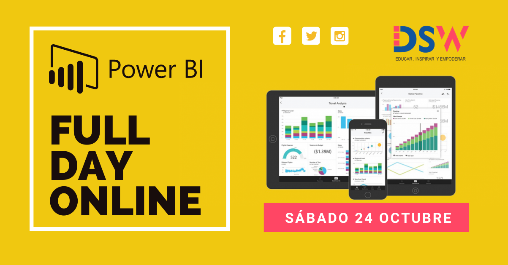

# Primer FullDay Power BI

<!-- PROJECT LOGO -->
 

  
  <h3 align="center">Full day onlines gratuito 
  !Aprendamos juntos a crear indicadores increíbles para tu organización! </h3>  

## Ponencias: 

- Roberto Rodríguez

     * Cómo iniciar en Business Intelligence con Power BI.

- Alberto de Rossi

     * Integración de Power BI con Azure Cognitive Services y Machine Learning.

- Alfredo Diego Amez

     * Lenguaje M: No todo es DAX.

## Videos:

Les compartimos los links de los videos del ** I Full Day de Power BI** del 24 de octubre:

- [DSW Power BI Parte 1](http://bit.ly/DSW_FullDay_Power_BI_Parte1)

- [DSW Power BI Parte 2](http://bit.ly/DSW_FullDay_Power_BI_Parte2)

